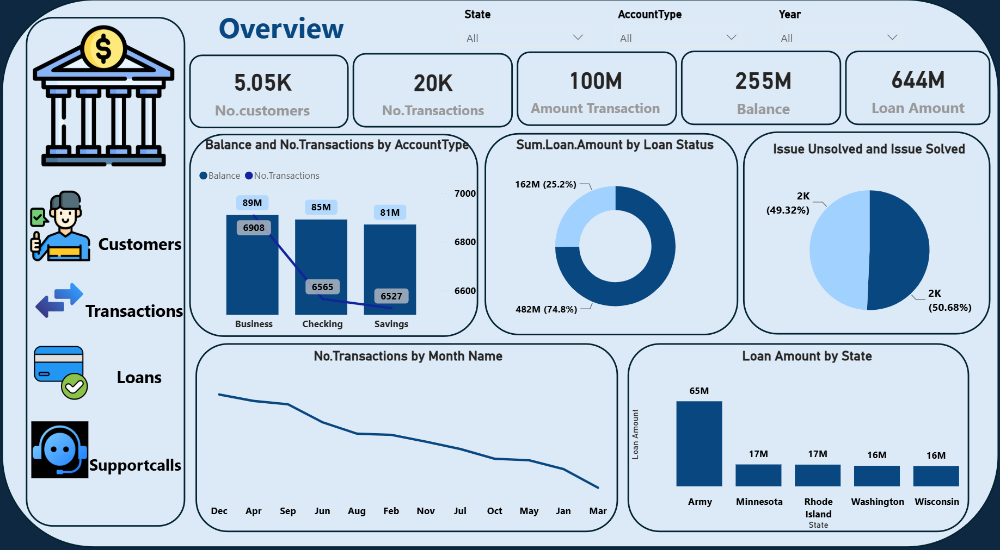
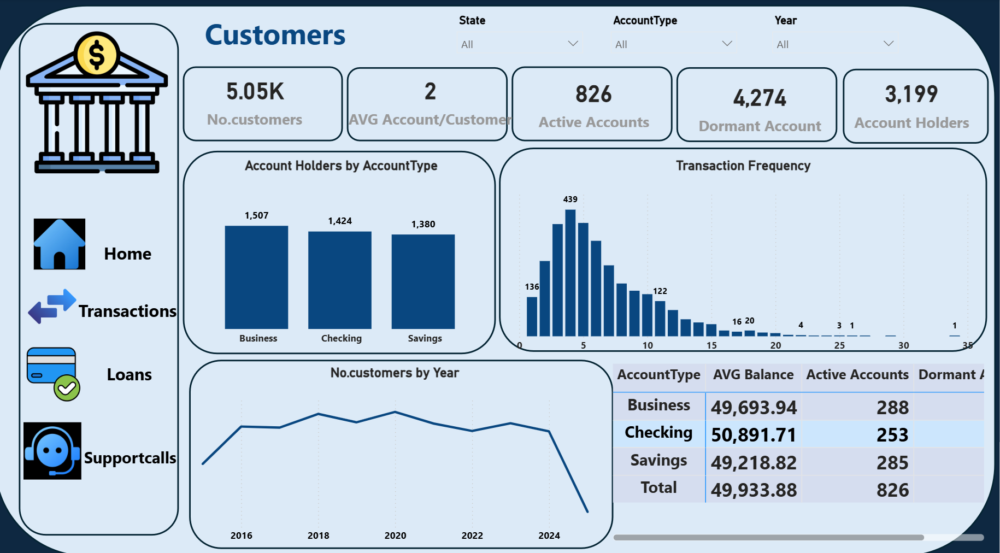
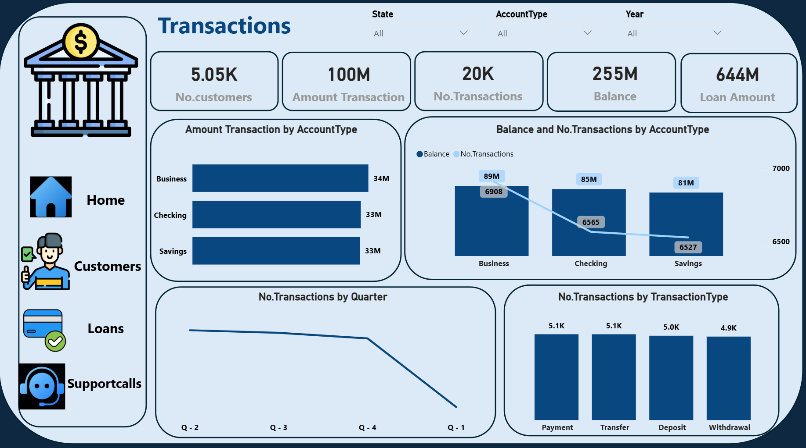
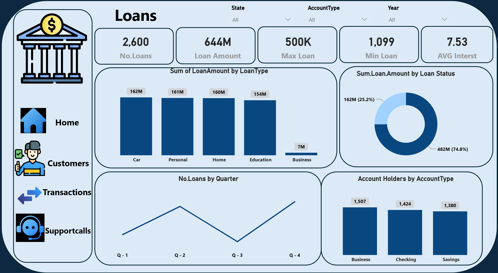
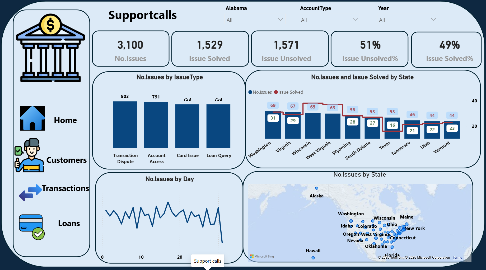
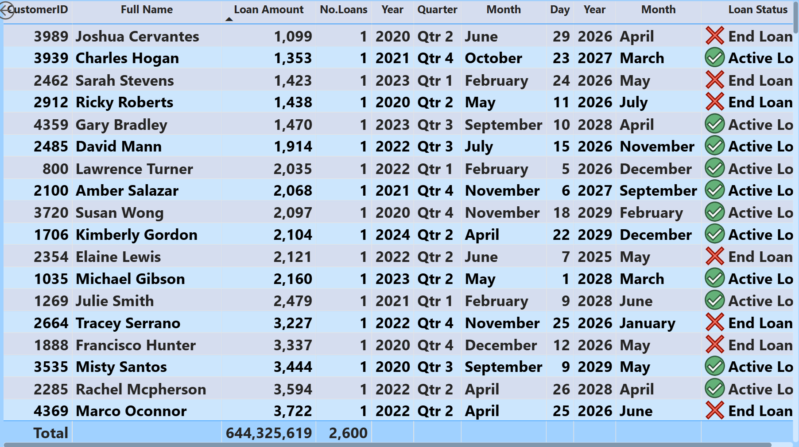
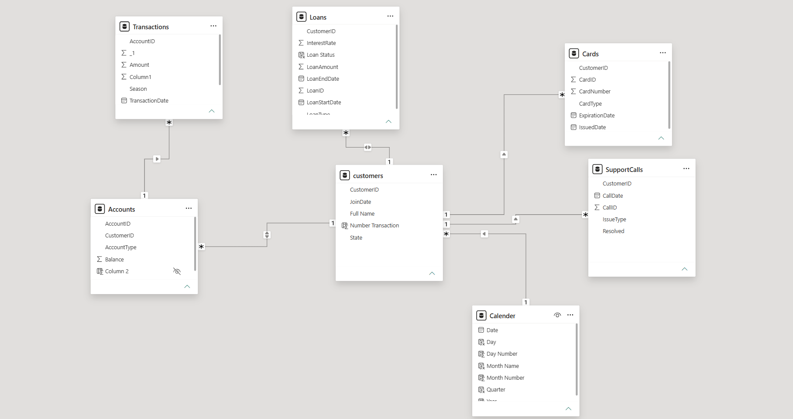

# 📊 Banking Analytics Dashboard

## 📌 Project Overview
This project is an interactive Power BI dashboard designed to analyze banking data and provide business insights about customers, transactions, loans, and support calls.

## 📂 Dashboard Pages
- Overview
- Customers
- Transactions
- Loans
- Support Calls
- Loan Tracking

## 🛠 Tools Used
- Power BI
- Power Query
- DAX
- Data Modeling
- Microsoft Excel
- Flaticon

## 📈 Key Features
- Interactive Dashboard
- KPI Cards
- Customer Analysis
- Transaction Analysis
- Loan Analysis
- Support Calls Analysis
- Loan Tracking
- Data Model

## 📷 Dashboard Preview

### Overview

### Customers

### Transactions

### Loans

### Support Calls

### Loan Details

### Data Model

## 💼 Skills Demonstrated
- Data Cleaning
- Data Modeling
- DAX
- Data Visualization
- Business Intelligence
- Dashboard Design
